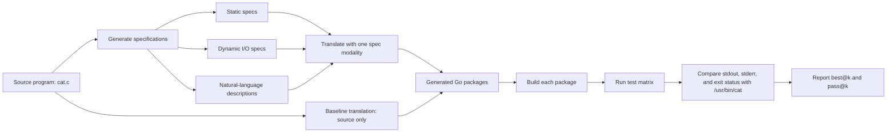
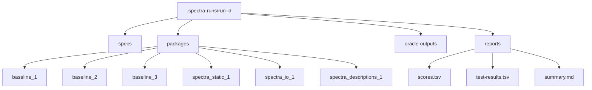

# SPECTRA `cat.c` to Go Experiment

This repository experiments with translating GNU Coreutils `cat.c` to Go using the SPECTRA method from `spectra.pdf`.

The local workflow uses `opencode` agents to generate baseline and SPECTRA-guided Go packages, then evaluates every generated binary against `/usr/bin/cat`.

## Workflow

SPECTRA compares normal LLM translation against specification-guided translation.



The baseline is generated with only the source file:

```text
LLM(cat.c) -> Go candidate
```

The SPECTRA candidates are generated with the source plus exactly one specification modality:

```text
LLM(cat.c + static spec) -> Go candidate
LLM(cat.c + I/O spec) -> Go candidate
LLM(cat.c + description spec) -> Go candidate
```

The script intentionally does not combine all specs in one prompt. The paper reports that larger combined prompts can degrade translation quality.

## Agent Layout

Each candidate gets an isolated package directory.



## Running

Use the faster model that produced the successful local run:

```bash
./run_spectra_cat_go.py --model openai/gpt-5.4-mini-fast --auto-approve
```

Useful options:

```bash
./run_spectra_cat_go.py --model openai/gpt-5.4-mini-fast --candidates 3 --auto-approve
./run_spectra_cat_go.py --model openai/gpt-5.4-mini-fast --auto-approve --opencode-timeout 300
./run_spectra_cat_go.py --model openai/gpt-5.4-mini-fast --evaluate-existing .spectra-runs/20260701T015652Z
```

Generated run artifacts are ignored by git under `.spectra-runs/`.

## Evaluation

The evaluator builds each generated Go package and runs a 17-case test matrix against `/usr/bin/cat`.

Each test compares:

```text
stdout bytes
normalized stderr
exit status
```

The score is:

```text
score = passed_tests / total_tests
best@k = max(score) among the first k candidates in that group
absolute improvement = spectra best@k - baseline best@k
relative improvement = (spectra best@k - baseline best@k) / baseline best@k
```

## Local Results

Valid run:

```text
.spectra-runs/20260701T015652Z
model: openai/gpt-5.4-mini-fast
oracle: /usr/bin/cat
tests: 17
```

Article-style comparison, using number of passing tests out of 17 as the correctness count:

| Method | pass@1 correct | pass@2 correct | pass@3 correct | pass@1 improvement | pass@2 improvement | pass@3 improvement |
|---|---:|---:|---:|---:|---:|---:|
| Baseline | 15 | 16 | 16 | - | - | - |
| SPECTRA | 15 | 17 | 17 | 0% | 6.25% | 6.25% |

Candidate-level results:

| Candidate | Group | Spec modality | Build | Passed tests | Score | Full pass |
|---|---|---|---|---:|---:|---:|
| `baseline_1` | Baseline | none | built | 15/17 | 0.882353 | no |
| `baseline_2` | Baseline | none | built | 16/17 | 0.941176 | no |
| `baseline_3` | Baseline | none | built | 16/17 | 0.941176 | no |
| `spectra_static_1` | SPECTRA | static | built | 15/17 | 0.882353 | no |
| `spectra_io_1` | SPECTRA | I/O | built | 17/17 | 1.000000 | yes |
| `spectra_descriptions_1` | SPECTRA | descriptions | built | 16/17 | 0.941176 | no |

The winning local candidate was `spectra_io_1`. It passed all 17 tests, while the best baseline candidate passed 16 of 17.

## Notes

This experiment is smaller than the paper's benchmark. The paper reports pass@k across hundreds of source programs or functions. This repo currently measures one source program with multiple generated candidates and a focused `/usr/bin/cat` compatibility test matrix.
