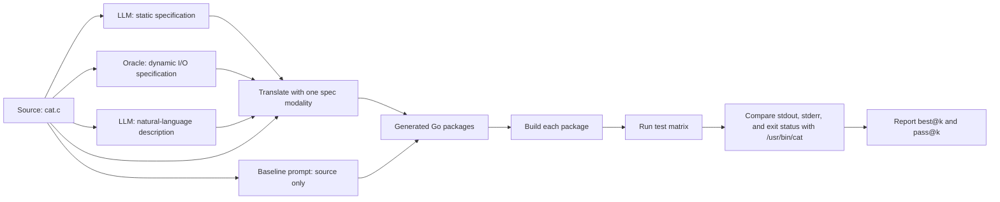
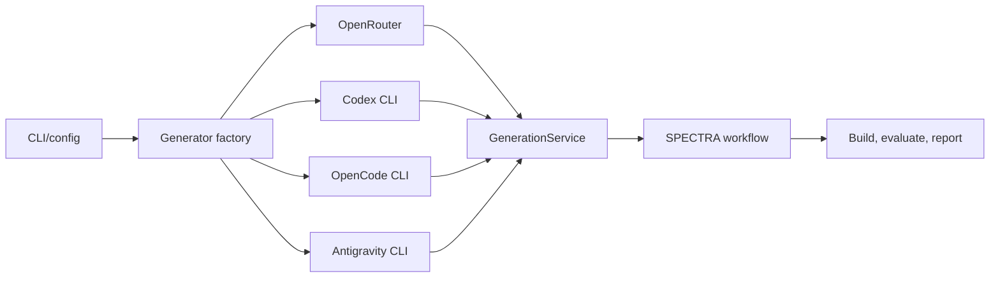
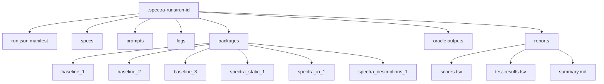

# SPECTRA `cat.c` to Go Experiment

This repository experiments with translating GNU Coreutils `cat.c` to Go using the SPECTRA method from `spectra.pdf`.

The workflow can use OpenRouter or the local Codex, OpenCode, and Antigravity CLIs to generate baseline and SPECTRA-guided Go packages, then evaluates every generated binary against `/usr/bin/cat`.

## How SPECTRA works

SPECTRA tests whether explicit behavioral specifications improve an LLM translation.
This repository runs two experimental arms with the same provider and model:

- **Baseline:** the model receives only `cat.c`.
- **SPECTRA:** the model receives `cat.c` and exactly one specification modality.

Keeping the provider, model, prompts, candidate count, build process, and evaluator
fixed makes the specification the intended experimental variable.



The three specification modalities are:

1. **Static specification:** model-generated contracts, preconditions,
   postconditions, invariants, option equivalences, and state behavior derived from
   `cat.c`.
2. **Dynamic I/O specification:** deterministic examples collected by running the
   configured oracle over the 17 test cases. Each example records arguments, stdin,
   stdout and normalized stderr as Base64, and exit status.
3. **Natural-language description:** a concise model-generated explanation of
   user-visible behavior, option effects, cross-file state, safe Go simplifications,
   and translation risks.

The generation equations are:

```text
LLM(cat.c) -> Go candidate
```

The SPECTRA candidates are generated with the source plus exactly one specification modality:

```text
LLM(cat.c + static spec) -> Go candidate
LLM(cat.c + I/O spec) -> Go candidate
LLM(cat.c + descriptions spec) -> Go candidate
```

Specifications are deliberately not combined. Each SPECTRA candidate gets one
modality so its effect remains measurable, and because the paper reports that larger
combined prompts can reduce translation quality.

`--candidates N` creates `N` baseline candidates and `N` SPECTRA candidates. The
SPECTRA arm rotates through `static`, `io`, and `descriptions`; values above three
start another round of the same sequence. Generation is sequential to preserve
candidate order for best@k reporting and avoid provider rate-limit contention.

The former source-map model call was removed because no downstream step consumed its
output.

### Experimental isolation and bias controls

The runner isolates the baseline and the three representation modalities so that a
candidate cannot receive information assigned to another arm:

| Arm | Prompt context | Explicitly excluded |
|---|---|---|
| Baseline | `cat.c` only | Static, dynamic I/O, and free-text specifications |
| Static | `cat.c` plus `static.md` | Dynamic I/O and free-text specifications |
| Dynamic I/O | `cat.c` plus `io.md` | Static and free-text specifications |
| Free text (`descriptions`) | `cat.c` plus `descriptions.md` | Static and dynamic I/O specifications |

The following controls reduce cross-arm contamination and comparison bias:

- Every candidate receives a newly constructed prompt containing only its permitted
  source and specification. No conversation or provider session is resumed between
  candidates.
- Every candidate has a separate package and `context/` directory. Files generated
  by one candidate are never attached to or embedded in another candidate's prompt.
- CLI providers execute each call in a new temporary working directory. Codex is
  also ephemeral and read-only; OpenCode uses pure mode; Antigravity uses its
  sandbox. Providers cannot inspect another candidate through the generation
  contract.
- Candidate output is returned as data rather than written by the provider. The
  orchestrator validates the same strict JSON contract and file allowlist for every
  arm.
- A run uses one provider and one explicit model for specification and candidate
  generation. Timeout, retry policy, source, candidate output requirements, build
  process, oracle, and evaluator are shared across arms.
- Baseline and SPECTRA use the same number of candidates. SPECTRA modalities rotate
  in a deterministic order, and group order is recorded for best@k/pass@k.
- The dynamic I/O representation is generated directly from the oracle, not from a
  previous model response or candidate. Static and free-text representations are
  generated independently from the original source.
- Prompt files, prompt hashes, provider/model identity, attempts, and timings are
  retained so context leakage or configuration drift can be audited after a run.

These controls reduce representation and context bias; they do not prove that the
experiment is bias-free. Model sampling is stochastic, static and free-text specs are
model-generated, and calls run sequentially in a fixed order, so provider load,
rate limits, or temporal model changes can affect results. Stronger studies should
repeat runs with multiple seeds or independent runs, rotate or randomize arm order,
and aggregate results across more source programs.

## Architecture

`run_spectra_cat_go.py` is a stable, thin executable entry point. Implementation is
split into a package with provider selection separated from experiment logic:

```text
run_spectra_cat_go.py          executable entry point
spectra_runner/
  cli.py                       composition root and error boundary
  config.py                    CLI parsing and immutable configuration
  generation.py                retries, strict JSON validation, safe writes, manifest
  logging_utils.py             UTC console/file logging and progress heartbeats
  workflow.py                  specs, candidates, builds, tests, scoring, reports
  generators/
    base.py                    Generator protocol, requests, formats, JSON Schema
    factory.py                 provider strategy selection
    cli.py                     Codex, OpenCode, and Antigravity CLI strategies
    openrouter.py              OpenRouter strategy through the OpenAI Python SDK
tests/                         configuration, strategy, retry, and safety tests
```

The workflow depends on the `Generator` protocol rather than provider-specific code:



### Generator contract

Every backend accepts the same fully embedded prompt; provider-specific attachment
or workspace context is not used. Specification calls return Markdown. Candidate
calls must return exactly one JSON document:

```json
{
  "files": [
    {"path": "go.mod", "content": "module candidate\n\ngo 1.23\n"},
    {"path": "main.go", "content": "package main\n..."}
  ]
}
```

Before writing anything, the runner rejects Markdown fences, extra JSON properties,
absolute paths, traversal, backslashes, duplicates, writes under `context/`, files
other than root-level `go.mod` and `*.go`, missing `go.mod`, and packages without a
Go source file. Candidate prompts prohibit third-party dependencies; the build step
then runs `go mod tidy` before compilation.

OpenRouter uses strict structured output through the official `openai` package and
requires a model that supports JSON Schema. Codex runs read-only and ephemeral;
native `--output-schema` is deliberately not used because code-heavy responses can
stall during schema finalization. Codex, OpenCode, and Antigravity outputs still pass
the same strict local JSON validation before files are written. OpenCode runs in pure
mode, while Antigravity uses sandboxed `agy --print`. CLI strategies run from
temporary directories rather than candidate package directories; only the Python
orchestrator writes validated files.

### Failure and retry behavior

Each call gets one initial attempt plus `--max-retries` retries with capped
exponential backoff. Transient provider failures, timeouts, empty responses, and
invalid candidate JSON enter the same retry path.

- A static or descriptions specification failure aborts the run because downstream
  candidates require it.
- A candidate failure is logged, assigned no generated package, and evaluation
  continues; its missing build scores zero.
- A heartbeat every 30 seconds identifies the active generation step, elapsed time,
  and configured timeout.
- The run directory must be new and empty, preventing mixed experiment artifacts.
- Evaluation-only mode never requires a provider, model, credentials, or generator
  executable.

### Changes from the original runner

| Area | Previous behavior | Current behavior |
|---|---|---|
| Provider support | OpenCode-specific | Strategy-based OpenRouter, Codex, OpenCode, and Antigravity |
| Generated files | CLI agents edited package directories | All providers return strict JSON; the orchestrator validates and writes files |
| Inputs | Provider-specific file attachments | Identical source/spec content embedded into provider-neutral prompts |
| Configuration | OpenCode-specific timeout, model environment, and auto-approval flags | Shared provider, model, generation timeout, and retry options |
| Dependencies | Standalone script assumptions | Python 3.11+ uv project with locked `openai`, pytest, and Ruff dependencies |
| Run metadata | Output directories and reports | `run.json` hashes, versions, attempts, durations, statuses, and errors |
| Progress | Long provider calls appeared silent | DEBUG logging, persistent run log, candidate position, and 30-second heartbeats |
| Safety | Agent filesystem writes depended on CLI permissions | Temporary CLI working directories and a strict generated-file allowlist |
| Source map | Generated but unused model output | Removed |

## Run artifacts

Each candidate gets an isolated package directory.



Important artifacts:

| Path | Purpose |
|---|---|
| `cat.c` | Immutable source copy used by the run |
| `run.json` | Provider/model, generator version, source and prompt hashes, attempts, timings, and errors |
| `specs/static.md` | Model-generated static specification |
| `specs/io.md` | Oracle-generated dynamic I/O specification |
| `specs/descriptions.md` | Model-generated natural-language description |
| `prompts/` | Exact specification prompts used for reproducibility |
| `packages/<candidate>/context/` | Candidate source/spec inputs and modality metadata |
| `packages/<candidate>/TASK.md` | Exact candidate prompt |
| `logs/run.log` | Full DEBUG run log |
| `logs/*.response.log` | Raw successful provider responses per attempt |
| `logs/*.error.log` | Failed-attempt diagnostics |
| `reports/scores.tsv` | Candidate-level build and correctness scores |
| `reports/test-results.tsv` | Per-test stdout, stderr, and status comparisons |
| `reports/summary.md` | Human-readable best@k and pass@k report |

The manifest and logs never record API keys.

## Running

Install the locked environment:

```bash
uv sync --dev
```

Select exactly one provider and model per generation run:

```bash
uv run ./run_spectra_cat_go.py --provider codex --model MODEL
uv run ./run_spectra_cat_go.py --provider opencode --model PROVIDER/MODEL
uv run ./run_spectra_cat_go.py --provider antigravity --model "MODEL LABEL"
OPENROUTER_API_KEY=... uv run ./run_spectra_cat_go.py --provider openrouter --model PROVIDER/MODEL
```

Provider requirements:

| Provider | Requirement | Configuration |
|---|---|---|
| `openrouter` | OpenRouter account and structured-output-capable model | `OPENROUTER_API_KEY` |
| `codex` | Authenticated local `codex` CLI | `CODEX_BIN`, default `codex` |
| `opencode` | Configured local `opencode` CLI | `OPENCODE_BIN`, default `opencode` |
| `antigravity` | Authenticated Antigravity `agy` CLI | `ANTIGRAVITY_BIN`, default `agy` |

Useful options:

```bash
uv run ./run_spectra_cat_go.py --provider codex --model MODEL --candidates 3
uv run ./run_spectra_cat_go.py --provider codex --model MODEL --generation-timeout 300 --max-retries 2
uv run ./run_spectra_cat_go.py --evaluate-existing .spectra-runs/20260701T015652Z
```

Progress is written to stderr and to `logs/run.log`. Provider calls emit a
heartbeat every 30 seconds with elapsed time and the configured timeout. Console
logging defaults to `DEBUG`, including per-test matches, subprocess timing,
response sizes, and OpenRouter token usage. The file log always captures DEBUG
details.

Generated run artifacts are ignored by git under `.spectra-runs/`.

## Evaluation

The evaluator runs after generation or independently through `--evaluate-existing`.
For each candidate it runs `go mod tidy`, builds an isolated executable, and executes
a 17-case compatibility matrix against `/usr/bin/cat` (or `--oracle`). Tests cover
stdin, one and multiple files, `-` mixed with files, numbering, nonblank numbering,
blank squeezing, visible ends/tabs/nonprinting bytes, combined short options, ignored
`-u`, long options, and missing-file behavior.

Each test compares:

```text
stdout bytes             exact byte comparison
normalized stderr        command name normalized, remaining bytes compared
exit status              exact comparison
```

The score is:

```text
score = passed_tests / total_tests
best@k = max(score) among the first k candidates in that group
absolute improvement = spectra best@k - baseline best@k
relative improvement = (spectra best@k - baseline best@k) / baseline best@k
pass@k = 1 when any of the first k candidates passes all tests
```

A build failure scores zero. `scores.tsv` and `test-results.tsv` retain the
machine-readable evidence behind `summary.md`.

## Local Results

Valid run:

```text
.spectra-runs/20260701T015652Z
provider: opencode
model: openai/gpt-5.4-mini-fast
oracle: /usr/bin/cat
tests: 17
```

Article-style comparison, using number of passing tests out of 17 as the correctness count:

| Method | pass@1 correct | pass@2 correct | pass@3 correct | pass@1 improvement | pass@2 improvement | pass@3 improvement |
|---|---:|---:|---:|---:|---:|---:|
| Baseline | 15 | 16 | 16 | - | - | - |
| SPECTRA | 15 | 17 | 17 | 0% | 6.25% | 6.25% |

Candidate-level results:

| Candidate | Group | Spec modality | Build | Passed tests | Score | Full pass |
|---|---|---|---|---:|---:|---:|
| `baseline_1` | Baseline | none | built | 15/17 | 0.882353 | no |
| `baseline_2` | Baseline | none | built | 16/17 | 0.941176 | no |
| `baseline_3` | Baseline | none | built | 16/17 | 0.941176 | no |
| `spectra_static_1` | SPECTRA | static | built | 15/17 | 0.882353 | no |
| `spectra_io_1` | SPECTRA | I/O | built | 17/17 | 1.000000 | yes |
| `spectra_descriptions_1` | SPECTRA | descriptions | built | 16/17 | 0.941176 | no |

The winning local candidate was `spectra_io_1`. It passed all 17 tests, while the best baseline candidate passed 16 of 17.

## Notes

This experiment is smaller than the paper's benchmark. The paper reports pass@k across hundreds of source programs or functions. This repo currently measures one source program with multiple generated candidates and a focused `/usr/bin/cat` compatibility test matrix.
